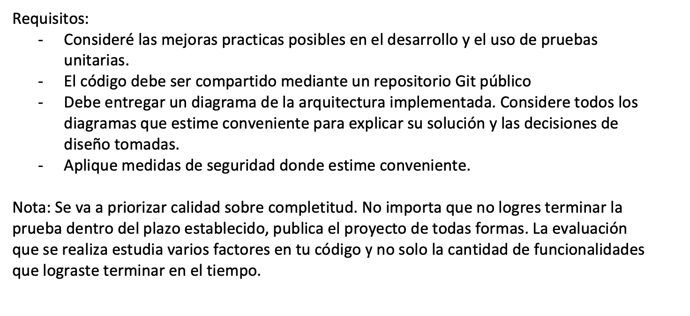
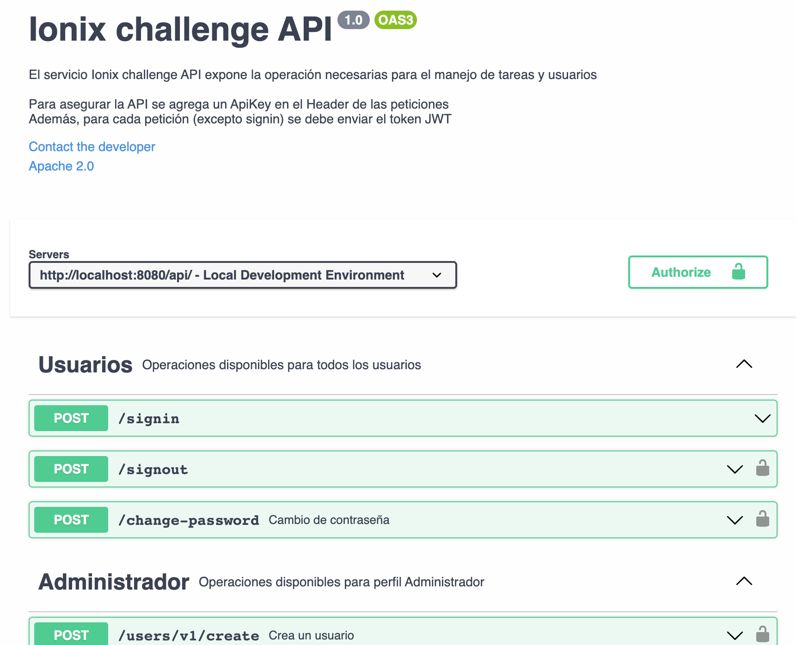
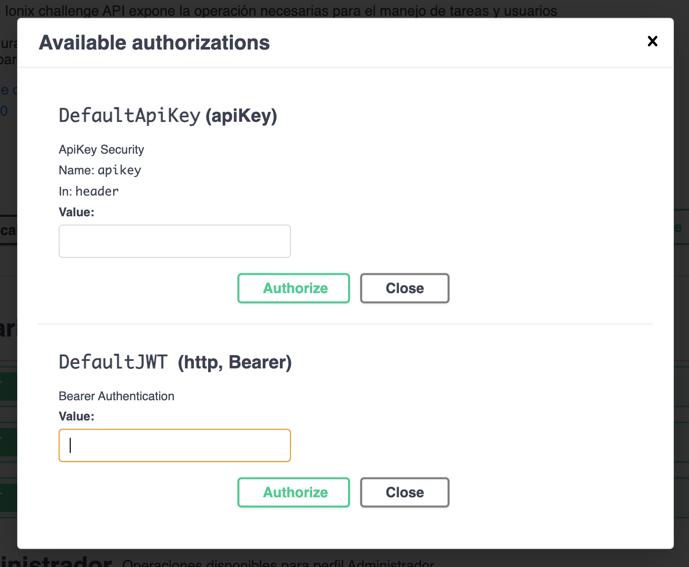
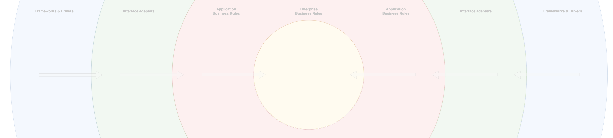
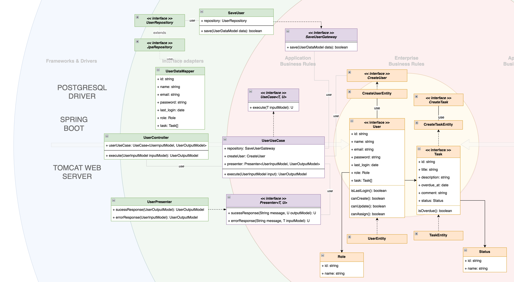
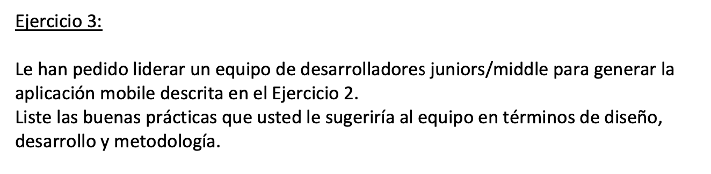

# DESAFÍO

## SOLUCIÓN

Para la solución se realiza una separación entre el diseño y la implementación.

### DISEÑO

Para el diseño de la solución al ejercicio 1 se comienza definiendo las entidades del dominio, encontrándose dos principales: Usuarios y Tareas

Se establecen algunos atributos iniciales que pueden tener estas entidades de negocio y sus relaciones, como se muestra en la siguiente imagen

Con esta información más los datos del enunciado se puede desarrollar la intracción interna que podrían tener estas entidades a nivel de capas dentro de la solución. A continuación, se exponen la interacción de las entidades por medio de diagramas de secuencia donde se muestran algunos detalles iniciales de cómo podría ser su implementación y las reglas de la aplicación y negocio

#### CRUD Usuarios

#### CRUD Tareas

En este punto, se pueden tomar decisiones acerca de la tecnología a utilizar, en este caso Java SpringBoot 

## OPEN API

Se ha diseñado y documentado la API con la herramienta Swagger (Open API). Enlace al OpenAPI de [IONIX API](https://app.swaggerhub.com/apis-docs/FAQ_CODES/ionix_api_test/1.0.0)

Se ha agregado seguridad a la API, tanto una API Key como JWT

Enlace al OpenAPI de [IONIX API](https://app.swaggerhub.com/apis-docs/FAQ_CODES/ionix_api_test/1.0.0)

## PATRÓN DE DISEÑO ARCHITECTURAL

Para el desarrollo de la aplicación se utiliza los principios de [The Clean Architecture](https://blog.cleancoder.com/uncle-bob/2012/08/13/the-clean-architecture.html) aplicado a los casos de uso.

Se intenta desacoplar la solución en capas de tal manera de "proteger" las reglas de negocio de los detalles de la infraestructura utilizando inversión de dependencias y sin anotaciones de SpringBoot para desacoplar, por ejemplo, el DI framework

Se presentan esquemas de cómo se han desarrollado los casos de uso, desde las reglas de negocio hasta la implementación de las interfaces utilizadas. A continuación, se presenta el caso de uso para crear un usuario. Los demás casos seguirán el mismo patrón.

## SOLUCIÓN

Plan de actividades para abarcar el requerimiento (con ayuda de ChatGPT):
1. Reunión con el cliente: Se debe realizar una reunión con el cliente para entender en detalle el requerimiento, aclarar dudas y establecer expectativas claras.
2. Análisis de los requisitos del cliente: El equipo de preventa debe analizar los requisitos del cliente y documentarlos para su posterior referencia.
3. Investigación de tecnologías: Se debe investigar las tecnologías más adecuadas para la construcción de una aplicación móvil, considerando las necesidades y requisitos del cliente.
4. Análisis de la API Omnichanel: El equipo de preventa debe analizar en detalle la API Omnichanel que será utilizada para la comunicación con el stock, registro de ventas y otros aspectos relacionados con los productos.
5. Evaluación de opciones de arquitectura: Se debe evaluar diferentes opciones de arquitectura para la aplicación móvil, considerando la selección de tecnología, la API Omnichanel y otros requisitos del cliente, como el rendimiento necesario.
6. Diseño de la arquitectura: Se debe diseñar la arquitectura de la aplicación móvil, considerando los requisitos del cliente, la tecnología seleccionada y la API Omnichanel.
7. Evaluación de herramientas de desarrollo: Se debe evaluar diferentes herramientas de desarrollo que puedan ser utilizadas para la construcción de la aplicación móvil, considerando los requisitos del cliente y la tecnología seleccionada.
8. Selección de herramientas de desarrollo: En base a la evaluación anterior, se debe seleccionar las herramientas de desarrollo adecuadas para la construcción de la aplicación móvil.
9. Desarrollo del backend: Se debe desarrollar el backend para la aplicación móvil, considerando los requisitos del cliente y la integración con la API Omnichanel.
10. Desarrollo de la aplicación móvil: Se debe desarrollar la aplicación móvil, considerando la arquitectura y los requisitos del cliente.
11. Pruebas: Se deben realizar pruebas unitarias, de integración y de sistema para validar que la aplicación móvil y el backend funcionen correctamente junto la integración de la API Omnichanel; y cumplan con los requisitos del cliente.
12. Implementación: Se debe implementar la aplicación móvil y el backend en un ambiente de producción.
13. Capacitación: Se debe proporcionar capacitación al cliente sobre la aplicación móvil para asegurar que puedan utilizarlos correctamente.

### Propuesta de arquitectura a muy alto nivel:

Para la arquitectura de la aplicación móvil se propone una solución híbrida utilizando una plataforma de desarrollo multiplataforma como Ionic o React Native. Esto debido a que no es necesario que la aplicación despliegue gráficos o animaciones, esta solución permitiría utilizar un conjunto de tecnologías web como HTML, CSS y JavaScript, y desplegar la aplicación móvil tanto en iOS como en Android.

El backend se desarrollaría utilizando un lenguaje de programación como Java o Python y se utilizaría una base de datos relacional para el registro de sesiones, usuarios, estadísticas de uso, sincronización con demás canales y otros aspectos relacionados con la aplicación móvil. La comunicación con la API Omnichanel externa se realizaría mediante una capa de servicio web RESTful.

La arquitectura propuesta permitiría desarrollar una aplicación móvil robusta y escalable, con un backend sólido que cumpla con los requisitos del cliente y con la integración de la API Omnichanel.

## SOLUCIÓN

A continuación, se presentan algunas buenas prácticas que se podrían sugerir al equipo de desarrolladores para la generación de la aplicación mobile (con ayuda de ChatGPT)

### Diseño UI/UX:
- Utilizar patrones de diseño establecidos para la creación de la interfaz de usuario, garantizando así una experiencia de usuario consistente y fácil de utilizar.
- Diseñar una interfaz de usuario intuitiva y accesible para los usuarios, considerando factores como la usabilidad, accesibilidad y adaptabilidad a diferentes tamaños de pantalla.
- Realizar pruebas de usabilidad y experiencia de usuario para validar el diseño y la interfaz de usuario.

### Diseño:

- Tener una visión de Mobile First para comenzar a desarrollar considerando la adaptabilidad a diferentes formas y tamaños de pantallas, así como la visualización de la integración con la API del backend
- Tener una visión API First, diseñando la API considerando métodos, paths, objetos de entrada y salida, documentación y mock de datos. Esto permite que el equipo pueda probar la API sin estar desarrollada.
- Diseñar los componentes de seguridad que incorporará la solución
- Establecer los patrones arquitecturales que tendrá la aplicación y guiar el desarrollo con dichos patrones. Se proponen patrones de arquitectura limpia como Clean/Hexagonal/Onion considerando los principios SOLID y Dry
- Generar diagramas necesarios para la visualización técnica de la solución: diagrama general con artefactos involucrados, diagrama de secuencia para visualizar la intereacción de los artefactos, diagrama de entidades para visualizar las entidades del negocio y la interacción entre ellas

### Desarrollo:
- Utilizar herramientas de control de versiones como Git para gestionar el código fuente, facilitando la colaboración y el seguimiento de los cambios.
- Configurar un CI/CD para la automatización del despliegue de la solición en distintos ambientes: develop, stagging, production
- Realizar pruebas unitarias y de integración para validar que el código funcione correctamente y para detectar problemas tempranamente.
- Utilizar un enfoque modular en el desarrollo, aplicar patrones de diseño de software, tales como: Factory Method, Singleton, DI, Strategy, etc. permitiendo así un mantenimiento más fácil y la reutilización del código.

### Metodología:
- Utilizar una metodología de desarrollo ágil, como Scrum o Kanban, para facilitar la colaboración y el seguimiento del progreso del proyecto. En este sentido:
  - Realizar reuniones de seguimiento diarias para asegurar que el equipo está en la misma página y para identificar y resolver problemas tempranamente.
  - Realizar retrospectivas de equipo después de cada sprint o etapa del proyecto, con el objetivo de identificar oportunidades de mejora y hacer ajustes necesarios en el proceso de desarrollo.

Estas son solo algunas de las buenas prácticas que se podrían sugerir al equipo de desarrolladores juniors/middle para la creación de la aplicación mobile. Es importante tener en cuenta que cada proyecto y equipo es diferente, por lo que las prácticas y metodologías utilizadas deben adaptarse a las necesidades y requisitos específicos del proyecto.
